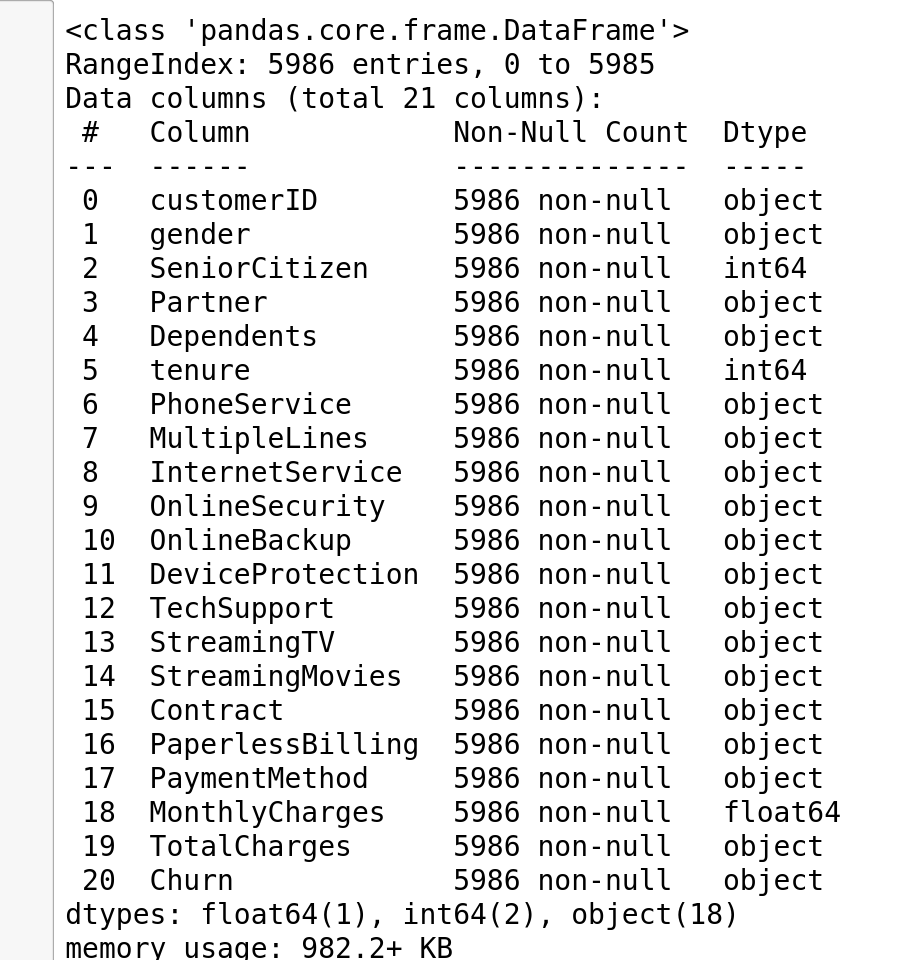

# Compte rendu du projet Churn

## Machine Learning 

### Data Vizualization et choix des variables à conserver
Dans un premier temps on a visualisé le type des données:


On ne gardera pas customerID qui est l'identifiant du client et est unique pour chaque ligne (inutilisable pour faire de la prédiction).

On observe que TotalCharges est du mauvais type et on le converti en valeur numérique puis on supprime les lignes dont la valeur de TotalCharges est vide (NaN), en effet elle ne représente qu'un très faible parti du jeu de donné 10/5986.

On peut ensuite faire une analyse descriptive des variables numériques:


On observe que SeniorCitizen est une variable numérique compris entre 1 et 0, on utilise un "value_counts()" pour voir que cette variable ne peut prendre que deux valeur 0 et 1. On peut la considérer comme une variable catégorielle

On observe que tenure est une variable numérique compris entre 1 et 72 avec des valeurs qui semblent entières. Pour confirmer cela fait un "value_counts()" et on voit qu'elle peut prendre 72 valeur différentes. Ensuite on trace des histogrammes pour observer leurs répartitions:


Ensuite à l'aide de la fonction countplot de seaborn 
on observe les variables catégorielles et leur répartition en fonction de la valeur de churn:

On remarque que pour les variables "Online backup", "DeviceProtection" que ceux qui n'ont pas ces services sont beaucoup plus sensibles au désabonnement.

On voit que la  différence entre le fait d'avoir ou non le streaming TV et streaming Movies n'influe pas sur le churn, de même pour le genre, on peut supprimer ces variables:  'Gender','StreamingTV','StreamingMovies'.

L'abonnement fibre est susceptible d'influencer sur le désabonnement surtout s'il est appuyé par le fait de ne pas bénéficier du support technique qui peut suggérer que le mécontentement se traduise par un désabonnement. En outre si l'abonné utilise le paiement en ligne, il serait assez prompt à résilier son abonnement.

On effectue ensuite la matrice de corrélation des variables quantitatives :


Comme il y a une forte corrélation (> 0.83) entre TotalCharges et tenure, on peut supprimer la variable TotalCharge pour ne pas risquer d'overfitter le modèle.

Ensuite on remplace le "no internet service" des différentes variables par "No" en effet cette information est déjà donnée par la variable InternetService.

Une fois ce travail de sélection des variables et de remplacement fait on obtient pour les variables catégorielles et leur répartitions en fonction de la valeur de churn, le graphique suivant:


### Fabrication des modèles de machine learning

Dans un premier temps pour pouvoir appliquer des algorithmes de machine learning de classification à nos données il faut convertir les variables catégorielles en variables indicatrices. Pour les variables catégorielles à deux choix avec Yes et No on remplace No par 0 et Yes par 1. Pour les variables catégorielles à plusieurs choix on utilise la fonction de pandas "get_dummies" pour les convertir en variables indicatrices.

Ensuite on a appliqué deux algorithmes de machine learning à nos jeux de données Randomforest et DecisionTreeClassifier. On a utilisé pour les deux des GridSearch pour sélectionner les meilleurs paramètres, on a utilisé ensuite plusieurs méthodes de scoring (accuracy,f1,recall) avec des résultats assez proches. Après on a sélectionné pour chaque algorithme de machine learning un résultat que l'on a sauvegardé avec joblib. On a également sauvegardé notre jeu de données test.


## L'API

Pour créer notre api nous avons utilisé la bibliothèque python fastapi

### Authentification et sécurité

Pour l'authentification nous avons utilisé la méthode des tokens présente dans fastapi.security avec les fonctions OAuth2PasswordBearer, OAuth2PasswordRequestForm en suivant la documentation fastapi.
```
https://fastapi.tiangolo.com/tutorial/security/oauth2-jwt/?h=token
```
En suivant cette même documentation nous avons utilisé la bibliothèque passlib.context avec la fonction CryptContext pour sécuriser l'authentification avec un hachage du mot de passe en base 64 et un algorithme de cryptage et une durée de validité pour les tokens créés.

Pour ce faire nous avons créé une fonction POST (/token) nommé login_for_access_token qui vérifie le nom d'utilisateur puis compare les mots de passe hachés. Si cela est vérifié il délivre un token qui permet de rester identifié.

Ce token d'identification est demandé pour toutes les autres fonctions de l'api.

### Point de terminaison
La fonction GET (/) get_index est un point de terminaison pour vérifier que l'API est bien fonctionnelle.

### Modelisation

La fonction POST ('/modelisation') modélisation permet de sélectionner un modèle de machine learning puis de rentrer les variables demandées pour ce modèle, il renvoie la prédiction de désabonnement selon de modèle et la probabilité de cette prédiction.

Pour les variables qualitatives ayant pour valeur des chaînes de caractères  nous avons utilisé la fonction enum de la bibliothèque enum pour forcer la sélection dans les valeurs possibles.
Pour la valeur de SeniorCitizen qui est un entier 0 ou 1, nous avons utilisé une condition qui renvoie une erreur si l'entier est différent de 0 ou 1.

Ensuite la fonction suivant le modèle le charge et renvoie sa prédiction avec les probabilités.

### Score
La fonction GET ('/score') get_score charge les différents modèles et renvoie pour chacun la valeur sur le jeu de test (sauvegardé en même temps que les modèles), les score d'accuracy et la valeur avec un moyenne "macro" pour les scores f1, precission et recall. 


## Docker

### L'API
Nous avons créé une image pour notre api avec un Dockerfile en utilisant l'image python:3.9, en important les bibliothèques nécessaires à son fonctionnement, en copiant le programme de l'api et les données utile et finalement la commande de lancements de l'api sur le port 8000.

### Docker TEST
Nous avons ensuite créé des conteneurs docker pour tester chaque application. 

Le docker authentification vérifie que le système d'authentification fonctionne en testant chaque utilisateur avec leurs mots de passe puis un utilisateur avec un mauvais mot de passe ensuite un mauvais utilisateur.

Le docker score charge un token avec la fonction login puis vérifie s’il a bien accès à la fonction score. Il vérifie également que la fonction renvoie une erreur si le token est incorrect.

Le docker get charge un token avec la fonction login puis vérifie s’il a bien accés à la fonction get. Il vérifie également que la fonction renvoie une erreur si le token est incorrect.

Le docker modelisation charge un token avec la fonction login puis vérifie le bon fonctionnement de la fonction en entrant toutes les valeurs possibles pour les variables catégorielles pour voir si elles sont toutes acceptées puis teste pour toute les variables une valeur non acceptée pour vérifier que la fonction renvoie une erreur. Il vérifie également que la fonction renvoie une erreur si le token est incorrect.

### Docker compose

Le docker compose permet de lancer de façon simplifiée le docker de l'api puis les dockers de test pour tester l'api. 

Nous avons ajouté la fonction sleep au début du script python de chaque docker test pour leur dire d'attendre 5 secondes avant de se lancer de manière à être sûr que l'api soit bien lancée. En effet lors de nos tests avec le docker compose nous avons rencontré des erreurs lors de l’exécution des dockers de test :
```
NewConnectionError('<urllib3.connection.HTTPConnection object at 0x7f3d2aac5a50>: Failed to establish a new connection: [Errno 111] Connection refused'))
```
La fonction sleep a permis de résoudre cette erreur.


## Kubernetes

Nous avons créé le fichier deployments.yml de façon à déployer l'api sur 3 pods (replicas: 3) avec le label app: churn-api. Nous indiquons également que nous souhaitons exposer le port 8000.

Ensuite on deploie le service de type ClusterIP avec le fichier service.yml, il s'applique sur les pods ayant le label app:churn-api et cible le port 8000 sur lequel fonctionne notre api. Le type de service est ClusterIP, il permet de fournir un nom et une adresse IP unique au pods de son cluster.

Enfin on déploie un ingress avec le fichier ingress.yml, il permet de donner un accès externe au service dans un cluster. Dans les paramètres de notre ingress, on a défini qu'il agit sur le service churn-service que nous avons créé précédemment.

Nous avons rencontré un problème lors du déploiement pour déployer notre api avec minikube, pour résoudre le problème nous avons trouvé la solution sur stackoverflow
```
https://stackoverflow.com/questions/55392014/kubectl-get-pods-shows-errimagepull

https://stackoverflow.com/questions/40600419/why-am-i-getting-an-errimagepull-error-in-this-kubernetes-deployment
```
Ou il était expliqué que pour la lancer sur minikube on devait monter l'image sur le docker de minikube grâce à la commande suivante à exécuter avant de créer l'image.
```
eval $(minikube docker-env)
```
Elle permet de créer l'image sur minikube

On devait également ajouter la ligne suivantes au déploiement pour utiliser l'image créée localement : il va d'abord chercher l'image localement par défaut et si elle n'est pas présente va la chercher sur docker hub.
```
imagePullPolicy: IfNotPresent
```
